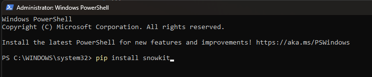

# Snowkit

## Getting started

### What is Snowkit

Snowkit is a framework to help companies who want to build a new DWH on Snowflake. To give them a structure that they will not start from scratch when developing a DWH. Thanks to this structure, they should be able to process data within 1-2 days. It will include many functionalities and standards that are basically needed. In this way, companies will be able to start their work without thinking too much or with something they can think of. They will be able to start production without wasting time. In addition to time, there will also be an effort savings. And while doing this, it will definitely not be limiting. It will be an expandable and easily changeable structure. That's why we call it fundemantal. You will be able to use the whole structure or you will be able to use it by changing only a part or some parts of it.


* There will be standards, so you will get rid of the question of how to name which object and how to name it, how to build layers. At least you will not start from scratch, you will have a bit of structure that you can change according to your own structure.
* There will be reusable objects. For example procedure, function etc. And all these will come to you in a tested way and with the structure and data required for testing.
* Making data management easier and standardized with a parametric structure
* `Providing a ready-made structure for parameter management
* Providing an extensible structure without being restrictive
* Providing an understandable and easy-to-use structure
* Providing a ready-made structure for data quality
* Logging and a restartable orachestration


```text
pip install snowkit
```



???+ tip

    We recommend using a clean virtual environment for your experiments! Read the detailed instructions on how to set up one.

## Code blocks examples

```python title="snowkit is able to load data from Python generators or directly from Python data structures:"
import snowkit

@snowkit.resource
def foo():
    for i in range(10):
        yield {"id": i, "name": f"This is item {i}"}

pipeline = snowkit.pipeline(
    pipeline_name="python_data_example",
    destination="duckdb",
)

load_info = pipeline.run(foo)
```

1. :man_raising_hand: Code annotation example

???+ tip

    If you'd like to try out dlt without installing it on your machine, check out the Google Colab demo.

## Join the snowkit community
Give the library a ⭐ and check out the code on [GitHub](https://github.com/search?q=snowkit&type=repositories).
Ask questions and share how you use the library on Slack.
Report problems and make feature requests here.